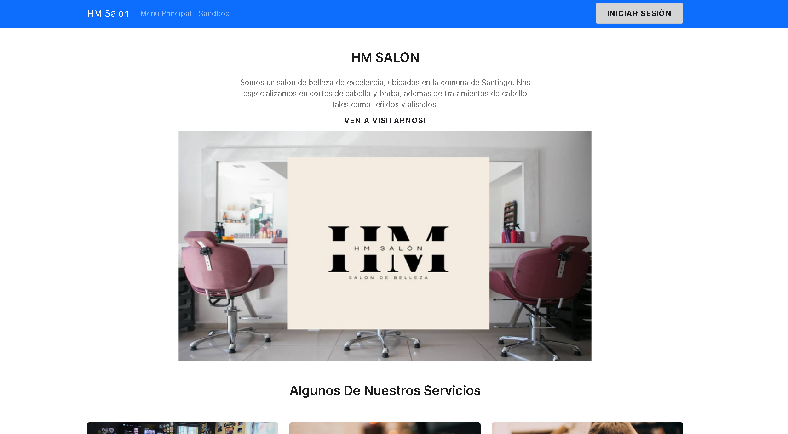

<!-- Improved compatibility of back to top link: See: https://github.com/othneildrew/Best-README-Template/pull/73 -->
<a name="readme-top"></a>
<!--
*** Thanks for checking out the Best-README-Template. If you have a suggestion
*** that would make this better, please fork the repo and create a pull request
*** or simply open an issue with the tag "enhancement".
*** Don't forget to give the project a star!
*** Thanks again! Now go create something AMAZING! :D
-->


<!-- PROJECT SHIELDS -->
<!--
*** I'm using markdown "reference style" links for readability.
*** Reference links are enclosed in brackets [ ] instead of parentheses ( ).
*** See the bottom of this document for the declaration of the reference variables
*** for contributors-url, forks-url, etc. This is an optional, concise syntax you may use.
*** https://www.markdownguide.org/basic-syntax/#reference-style-links
-->


<!-- PROJECT LOGO -->
<br />
<div align="center">
  <a href="https://github.com/lagossully/TICS_II">
    
  </a>

  <h3 align="center">Página H&M Salón</h3>

  <p align="center">
    Una página web para administrar el salón de belleza "H&M Salon"
    <br />
    <a href="https://github.com/lagossully/TICS_II"><strong>Explorar»</strong></a>
  </p>
</div>


<!-- TABLE OF CONTENTS -->
<details>
  <summary>Table of Contents</summary>
  <ol>
    <li>
      <a href="#acerca-del-proyecto">Acerca del Proyecto</a>
      <ul>
        <li><a href="#Construcción">Construcción</a></li>
      </ul>
    </li>
    <li>
      <a href="#uso">Getting Started</a>
      <ul>
        <li><a href="#prerrequisitos">Prerequisites</a></li>
        <li><a href="#instalación">Installation</a></li>
      </ul>
    </li>
    <li><a href="#uso">Usage</a></li>
    <li><a href="#roadmap">Roadmap</a></li>
    <li><a href="#contacto">Contact</a></li>
  </ol>
</details>


<!-- ABOUT THE PROJECT -->
## Acerca del Proyecto


Esta documentación busca describir el proyecto semestral del ramo de TICs II, el cual está enfocado en hacer un proyecto que le dé valor agregado hacia una empresa y es elaborado por tres alumnos, Álex Castro, Marcos Fantoval, Diego Lagos.

La empresa H&M Salón tiene una problemática a solucionar, se analiza el contexto en el que está situada y que necesidades tiene. Luego se consideran soluciones para la problemática, una vez se haya elegido, deben modelarse las funcionalidades de esta, el alcance, las restricciones, los procesos de negocios, las tareas a realizar y los tiempos que se van a dedicar.

La solución planteada es crear una aplicación web que se planea para facilitar el orden de los horarios e inventario de la empresa.. Ésta solución nace de la necesidad de modernizar el funcionamiento de la empresa, hasta ahora la organización de horas y el inventario se hacen a mano, de forma análoga y sin un orden digital. Es por eso que la solución propuesta facilita los horarios y el inventario de implementos. 


<p align="right">(<a href="#readme-top">↑↑↑</a>)</p>


### Construcción
El modelo de arquitectura elegido es la arquitectura tipo "Cliente-Servidor" con el Stack MERN.
Las frameworks/librerías principales que se usaron:

* [React][React-url]
* [MongoDB][Mongodb-url]
* [Express][Express-url]
* [Node][Node-url]

<p align="right">(<a href="#readme-top">↑↑↑</a>)</p>


<!-- GETTING STARTED -->
## Uso

Para instalar este stack siga los siguientes pasos:

* Montar la API mendiante Node
* Montar la base de datos mediante MongoDB

Para montar localmente ingrese los siguientes comandos en una terminal:

```sh
npm run dev
```
Además de:

```sh
npm run webpack
```
 

### Prerrequisitos

Instalar npm
* npm
  ```sh
  npm install npm@latest -g
  ```

### Instalación

1. Clonar el repositorio
   ```sh
   git clone https://github.com/lagossully/TICS_II
   ```
3. Instalar paquetes NPM
   ```sh
   npm install
   ```
 

<p align="right">(<a href="#readme-top">↑↑↑</a>)</p>


## Uso


De la parte del cliente blablablablablablabla

El peluquero puede blablabla con el botón blablabla 

Con la vista del administrador blablabla


<p align="right">(<a href="#readme-top">↑↑↑</a>)</p>


<!-- ROADMAP -->
## Roadmap

- [x] Montar base de datos
- [x] Terminar backend
    - [x] Funcionalidades 
    - [x] Comprobación de datos
- [x] Terminar frontend
- [ ] Agregar seguridad de paquetes
- [ ] Montar en la nube AWS
    - [ ] VPC
    - [ ] EC2
    - [ ] Route 53

See the [open issues](https://github.com/othneildrew/Best-README-Template/issues) for a full list of proposed features (and known issues).

<p align="right">(<a href="#readme-top">↑↑↑</a>)</p>


<!-- CONTACT -->
## Contacto

Your Name  - email@example.com

Alex Castro - Alex.castro@mail.udp.cl
Marcos Fantoval - Marcos.fantoval@mail.udp.cl
Diego Lagos - Diego.lagos@mail.udp.cl

<p align="right">(<a href="#readme-top">↑↑↑</a>)</p>


<!-- MARKDOWN LINKS & IMAGES -->
<!-- https://www.markdownguide.org/basic-syntax/#reference-style-links -->
[contributors-shield]: https://img.shields.io/github/contributors/othneildrew/Best-README-Template.svg?style=for-the-badge
[contributors-url]: https://github.com/lagossully/TICS_II/graphs/contributors
[forks-shield]: https://img.shields.io/github/forks/othneildrew/Best-README-Template.svg?style=for-the-badge
[forks-url]: https://github.com/lagossully/TICS_II/network/members
[stars-shield]: https://img.shields.io/github/stars/othneildrew/Best-README-Template.svg?style=for-the-badge
[stars-url]: https://github.com/othneildrew/Best-README-Template/stargazers
[issues-shield]: https://img.shields.io/github/issues/othneildrew/Best-README-Template.svg?style=for-the-badge
[issues-url]: https://github.com/othneildrew/Best-README-Template/issues
[license-shield]: https://img.shields.io/github/license/othneildrew/Best-README-Template.svg?style=for-the-badge
[license-url]: https://github.com/othneildrew/Best-README-Template/blob/master/LICENSE.txt
[linkedin-shield]: https://img.shields.io/badge/-LinkedIn-black.svg?style=for-the-badge&logo=linkedin&colorB=555
[linkedin-url]: https://linkedin.com/in/othneildrew
[product-screenshot]: images/screenshot.png
[Next.js]: https://img.shields.io/badge/next.js-000000?style=for-the-badge&logo=nextdotjs&logoColor=white
[Next-url]: https://nextjs.org/
[React.js]: https://img.shields.io/badge/React-20232A?style=for-the-badge&logo=react&logoColor=61DAFB
[React-url]: https://reactjs.org/
[mongodb.com]: [https://www.mongodb.com/](https://webimages.mongodb.com/_com_assets/cms/kuyjf3vea2hg34taa-horizontal_default_slate_blue.svg?auto=format%252Ccompress)
[Express-url]: https://expressjs.com/
[Mongodb-url]: https://www.mongodb.com/
[Node-url]: https://nodejs.org/en/
[Vue.js]: https://img.shields.io/badge/Vue.js-35495E?style=for-the-badge&logo=vuedotjs&logoColor=4FC08D
[Vue-url]: https://vuejs.org/
[Angular.io]: https://img.shields.io/badge/Angular-DD0031?style=for-the-badge&logo=angular&logoColor=white
[Angular-url]: https://angular.io/
[Svelte.dev]: https://img.shields.io/badge/Svelte-4A4A55?style=for-the-badge&logo=svelte&logoColor=FF3E00
[Svelte-url]: https://svelte.dev/
[Laravel.com]: https://img.shields.io/badge/Laravel-FF2D20?style=for-the-badge&logo=laravel&logoColor=white
[Laravel-url]: https://laravel.com
[Bootstrap.com]: https://img.shields.io/badge/Bootstrap-563D7C?style=for-the-badge&logo=bootstrap&logoColor=white
[Bootstrap-url]: https://getbootstrap.com
[JQuery.com]: https://img.shields.io/badge/jQuery-0769AD?style=for-the-badge&logo=jquery&logoColor=white
[JQuery-url]: https://jquery.com 
